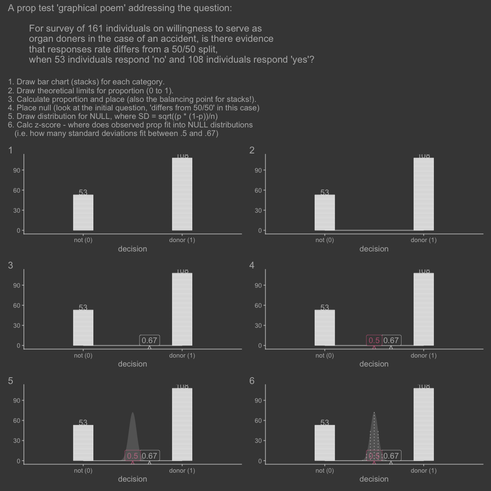
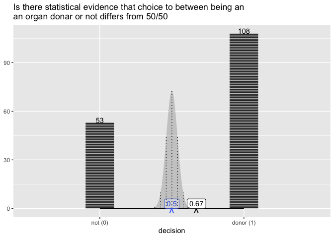

<!-- README.md is generated from README.Rmd. Please edit that file -->

Introducing ggprop.test, a micro package to teach the logic of the prop
test.

``` r
library(tidyverse)

isi_donor_url <- "https://www.isi-stats.com/isi/data/prelim/OrganDonor.txt"

donor <- read_delim(isi_donor_url) %>%
  select(Default, Choice) %>% 
  dplyr::mutate(decision = ifelse(Choice == "donor", "donor (1)", "not (0)")) %>% 
  dplyr::mutate(decision = fct_rev(decision)) 

head(donor)
#> # A tibble: 6 × 3
#>   Default Choice decision 
#>   <chr>   <chr>  <fct>    
#> 1 opt-in  donor  donor (1)
#> 2 opt-in  donor  donor (1)
#> 3 opt-in  donor  donor (1)
#> 4 opt-in  donor  donor (1)
#> 5 opt-in  donor  donor (1)
#> 6 opt-in  donor  donor (1)
```

``` r
library(ggprop.test)
snapshot <- ggplyr::intercept


donor |>
  ggplot() + 
  aes(x = decision) +
  geom_stack() + 
  geom_stack_label() + snapshot("p1") +
  geom_support() + snapshot("p2") +
  geom_prop() + 
  geom_prop_label() + snapshot("p3") +
  stamp_prop() + 
  stamp_prop_label() + snapshot("p4") +
  geom_normal_prop_null() + snapshot("p5") +
  geom_normal_prop_null_sds() + snapshot("p6") -> hide


library(patchwork)
(p1 + p2) / 
(p3 + p4) /
(p5 + p6)  + 
  patchwork::plot_annotation(
    tag_levels = 1,
    title = "A prop test 'graphical poem' addressing the question: 
    
        For survey of 161 individuals on willingness to serve as 
        organ doners in the case of an accident, is there evidence
        that responses rate differs from a 50/50 split, 
        when 53 individuals respond 'no' and 108 individuals respond 'yes'?
      ",
    subtitle = "1. Draw bar chart (stacks) for each category.
2. Draw theoretical limits for proportion (0 to 1).
3. Calculate proportion and place (also the balancing point for stacks!).
4. Place null (look at the initial question, 'differs from 50/50' in this case)
5. Draw distribution for NULL, where SD = sqrt((p * (1-p))/n)
6. Calc z-score - where does observed prop fit into NULL distributions 
   (i.e. how many standard deviations fit between .5 and .67)"
                             ) &
  ggchalkboard:::theme_blackboard(base_size = 14) 
```

<!-- -->

------------------------------------------------------------------------

# What’s inside and how did we get here?

``` r
library(tidyverse)

# 1. layer stack of bricks
compute_group_bricks <- function(data, scales, width = .2){
  
  data %>% 
    dplyr::mutate(row = row_number()) %>% 
    dplyr::mutate(y = row - .5) %>% 
    dplyr::mutate(width = width)
  
}

# 2. layer label stack with count
compute_group_count <- function(data, scales){
  
  data %>% 
    dplyr::count(x) %>% 
    dplyr::mutate(y = n,
           label = n)
  
}


# 3. layer add x span
compute_scale <- function(data, scales){
  
  data %>% 
    dplyr::summarise(min_x = min(x),
              xend = max(x),
              y = 0,
              yend = 0) %>% 
    dplyr::rename(x = min_x)
  
}


# 4. layer add balancing point 
compute_xmean_at_y0 <- function(data, scales){
  
  data %>% 
    dplyr::summarise(x = mean(x),
              y = 0, 
              label = "^") 
  
}

# 5. layer add balancing point value label
compute_xmean_at_y0_label <- function(data, scales){
  
  data %>% 
    dplyr::summarise(x = mean(x),
              y = 0, 
              label = after_stat(round(x - 1, 2))) 
  
}


# 6. Add 'point' for asserted balancing point
compute_panel_prop_asserted <- function(data, scales, null = .5){
  
  # stamp type layer - so ignor input data
  data.frame(y = 0, 
             x = null + 1,
             label = "^"
             )
  
}

# 6. Add label for asserted balancing point
compute_panel_prop_asserted_label <- function(data, scales, null = .5){
  
  # stamp type layer - so ignor input data
  data.frame(y = 0, 
             x = null + 1,
             label = round(null, 2)
             )
  
}


# Proposed layer composition
compute_dnorm_prop <- function(data, scales, null = .5,   dist_sds = seq(-3.5, 3.5, by = .1)
){
  
  n <- nrow(data)
  
  sd = sqrt(null * (1 - null)/n) # sd of the null distribution
  
  q <- dist_sds * sd + null
  
  data.frame(x = q + 1) %>%
    dplyr::mutate(height = dnorm(q, sd = sd, mean = null)) %>%
    dplyr::mutate(height_max = dnorm(0, sd = sd, mean = 0)) %>%
    dplyr::mutate(y = .45*n*height/height_max) %>%  # This is a bit fragile...
    dplyr::mutate(xend = x,
           yend = 0) %>% 
    # @teunbrand ggplot2::GeomArea$setup_data() requires a group column. Your panel computation does not preserve groups, but it should.
    dplyr::mutate(group = 1) 
  
}  


# Proposed layer composition
compute_dnorm_prop_sds <- function(data, scales, null = .5,
  dist_sds = -4:4){
  
  n <- nrow(data)
  
  sd = sqrt(null * (1 - null)/n) # sd of the null distribution
  
  q <- dist_sds * sd + null
  
  data.frame(x = q + 1) %>%
    dplyr::mutate(height = dnorm(q, sd = sd, mean = null)) %>%
    dplyr::mutate(height_max = dnorm(0, sd = sd, mean = 0)) %>%
    dplyr::mutate(y = .45*n*height/height_max) %>% # This is a bit fragile...
    dplyr::mutate(xend = x,
           yend = 0)

}  
```

# step . statexpress functions

Some convenience functions from {statexpress} that we just copy, because
that might not be very stable…

``` r
qlayer <- function (mapping = NULL, data = NULL, geom = ggplot2::GeomPoint, stat = StatIdentity, 
    position = position_identity(), ..., na.rm = FALSE, show.legend = NA, 
    inherit.aes = TRUE) 
{
    ggplot2::layer(data = data, mapping = mapping, geom = geom, 
        stat = stat, position = position, show.legend = show.legend, 
        inherit.aes = inherit.aes, params = rlang::list2(na.rm = na.rm, 
            ...))
}

qstat <- function (compute_group = ggplot2::Stat$compute_group, ...) 
{
    ggplot2::ggproto("StatTemp", Stat, compute_group = compute_group, 
        ...)
}

qstat_panel <- function (compute_panel, ...) 
{
    ggplot2::ggproto("StatTemp", Stat, compute_panel = compute_panel, 
        ...)
}


proto_update <- function (`_class`, `_inherit`, default_aes_update = NULL, ...) 
{
    if (!is.null(default_aes_update)) {
        default_aes <- aes(!!!modifyList(`_inherit`$default_aes, 
            default_aes_update))
    }
    ggplot2::ggproto(`_class` = `_class`, `_inherit` = `_inherit`, 
        default_aes = default_aes, ...)
}

qproto_update <- function (`_inherit`, default_aes_update = NULL, ...) 
{
    proto_update("protoTemp", `_inherit`, default_aes_update = default_aes_update, 
        ...)
}
```

# Step 1. Use the compute in a rendered plot

Sketch mode - where you don’t actually define functions, we just have
proposals commented out.

``` r
donor |>
  ggplot() +
  aes(x = decision) +
  # 1 geom_stack
  qlayer(geom = qproto_update(GeomTile, aes(color = "white")), 
         stat = qstat(compute_group_bricks)) +
  # 2 geom_stack_label() 
  qlayer(geom = qproto_update(GeomText, aes(vjust = 0)), 
         stat = qstat(compute_group_count)) +
  # 3 geom_xrange, show scale, range at y is zero
  qlayer(geom = GeomSegment, 
         stat = qstat_panel(compute_scale)) +
  # 4. geom_prop, show prop, i.e. balancing point
  qlayer(geom = qproto_update(GeomText, aes(size = 6, vjust = 1)),
         stat = qstat_panel(compute_xmean_at_y0)) + 
  # 5. geom_prop_label, labeling prop, balancing point
  qlayer(geom = qproto_update(GeomLabel, aes(fill = from_theme(colour %||% paper), label.size = NA, vjust = 0)),
         stat = qstat_panel(compute_xmean_at_y0_label))  +   
  # 6. stamp_prop, assertion, point
  qlayer(geom = qproto_update(GeomText, aes(size = 6, vjust = 1, color = from_theme(colour %||% accent))),
         stat = qstat_panel(compute_panel_prop_asserted)) +
  # 7. stamp_prop_label, assertion, label
  qlayer(geom = qproto_update(GeomLabel, 
                              aes(fill = from_theme(colour %||% paper), 
                                  label.size = NA, vjust = 0, 
                                  color = from_theme(colour %||% accent))),
         stat = qstat_panel(compute_panel_prop_asserted_label)) +
  # 8. geom_norm on prop plot
  qlayer(geom = qproto_update(GeomArea, aes(alpha = .2)),
         stat = qstat_panel(compute_dnorm_prop)) + 
   # 9. geom_prop_norm w/ sd marks
   qlayer(geom = qproto_update(GeomSegment, aes(linetype = "dotted")),
          stat = qstat_panel(compute_dnorm_prop_sds)) +
  labs(title = "Is there statistical evidence that choice to between being an\nan organ donar or not differs from 50/50") 
```

<!-- -->

# And then define the functions…

``` r
#' @export
geom_stack <- function(...){
  qlayer(geom = qproto_update(ggplot2::GeomTile, ggplot2::aes(color = "white")), 
         stat = qstat(compute_group_bricks), 
         ...)
  } 

#' @export
geom_stack_label <- function(...){
  qlayer(geom = qproto_update(ggplot2::GeomText, ggplot2::aes(vjust = 0)), 
         stat = qstat(compute_group_count), 
         ...)
  } 

#' @export
geom_support <- function(...){
  qlayer(geom = ggplot2::GeomSegment, 
         stat = qstat_panel(compute_scale), 
         ...)
  }

#' @export
geom_prop <- function(...){
  qlayer(geom = qproto_update(ggplot2::GeomText, ggplot2::aes(size = 6, vjust = 1)),
         stat = qstat_panel(compute_xmean_at_y0),
         ...)
  }

#' @export
geom_prop_label <- function(...){ 
  qlayer(geom = qproto_update(ggplot2::GeomLabel, 
                              ggplot2::aes(fill = ggplot2::from_theme(colour %||% paper), label.size = NA, vjust = 0)),
         stat = qstat_panel(compute_xmean_at_y0_label), 
         ...) 
  }

#' @export
stamp_prop <- function(...){ 
  qlayer(geom = qproto_update(ggplot2::GeomText, 
                              ggplot2::aes(size = 6, 
                                           vjust = 1, 
                                           color = ggplot2::from_theme(colour %||% accent))),
         stat = qstat_panel(compute_panel_prop_asserted), 
         ...)
  }
  
#' @export  
stamp_prop_label <- function(...){  
  qlayer(geom = qproto_update(ggplot2::GeomLabel, 
                              ggplot2::aes(fill = ggplot2::from_theme(colour %||% paper), 
                                  label.size = NA, vjust = 0, 
                                  color = ggplot2::from_theme(colour %||% accent))),
         stat = qstat_panel(compute_panel_prop_asserted_label), 
         ...)
  }

#' @export
geom_normal_prop_null <- function(...){
  qlayer(geom = qproto_update(ggplot2::GeomArea, ggplot2::aes(alpha = .2)),
         stat = qstat_panel(compute_dnorm_prop), 
         ...)
  } 

#' @export
geom_normal_prop_null_sds <- function(...){
   qlayer(geom = qproto_update(ggplot2::GeomSegment, ggplot2::aes(linetype = "dotted")),
          stat = qstat_panel(compute_dnorm_prop_sds), 
          ...)
  }
```

Done! See the introduction for usage.

------------------------------------------------------------------------

``` r
knitrExtra::chunk_to_dir("statexpress")
knitrExtra::chunk_to_dir("compute_for_prop_story")
knitrExtra::chunk_to_dir("prop_poem_functions")
```

``` r
usethis::use_package("dplyr")
usethis::use_package("ggplot2")

devtools::document()
devtools::check(".")
devtools::install(pkg = ".", upgrade = "never")
```

<!-- # epilogue... -->
<!-- Another approach that is less concerned with being a bridge to ggplot2 layer extension...?   -->
<!-- ```{r, eval = F, echo = F} -->
<!-- geom_support <- function(...){geom_segment(data = compute_scale, ...)} -->
<!-- geom_prop <- function(...){geom_point(data = compute_xmean_at_y0, label = "^", ...)} -->
<!-- donor |> -->
<!--   ggplot() +  -->
<!--   aes(x = decision) + -->
<!--   geom_support() + -->
<!--   geom_prop() -->
<!-- ``` -->
