ggprop.test
================

- [Where we are headed (what ggprop.test
  delivers)](#where-we-are-headed-what-ggproptest-delivers)
- [{ggprop.test} is teaching ‘mvp’ (minimum viable package) that
  translates the visual logic of the prop test to
  ggplot2.](#ggproptest-is-teaching-mvp-minimum-viable-package-that-translates-the-visual-logic-of-the-prop-test-to-ggplot2)
  - [Motivation for ggproptest and
    friends.](#motivation-for-ggproptest-and-friends)
  - [An introductiong to packaging requirements via
    ggprop.test](#an-introductiong-to-packaging-requirements-via-ggproptest)
- [Back to exploring the prop test!!
  Yay!!](#back-to-exploring-the-prop-test-yay)
- [Data and Scenarios](#data-and-scenarios)
  - [scenario 1: organ donation](#scenario-1-organ-donation)
  - [scenario 2: dolphins](#scenario-2-dolphins)
  - [scenario 3: Rock paper scissors](#scenario-3-rock-paper-scissors)
  - [On demand scenarios](#on-demand-scenarios)
- [Visualizing raw data](#visualizing-raw-data)
- [Calc and Viz the Proportion, allowing null to be
  visualized](#calc-and-viz-the-proportion-allowing-null-to-be-visualized)
- [Interlude: What individual outcomes *would* we observe under null
  hypothesis?](#interlude-what-individual-outcomes-would-we-observe-under-null-hypothesis)
- [Distributions for the Null: What collections of hypothetical outcomes
  *could* we observe under null
  hypothesis?](#distributions-for-the-null-what-collections-of-hypothetical-outcomes-could-we-observe-under-null-hypothesis)
- [Minimal Packaging](#minimal-packaging)

<!-- README.md is generated from README.Rmd. Please edit that file -->

``` r
library(ggprop.test)
```

## Where we are headed (what ggprop.test delivers)

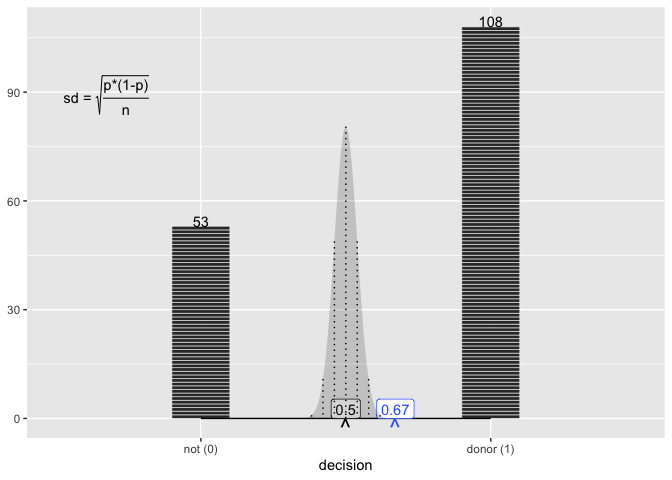<!-- -->

If we discuss each of the snapshot points, we could write something like
this:

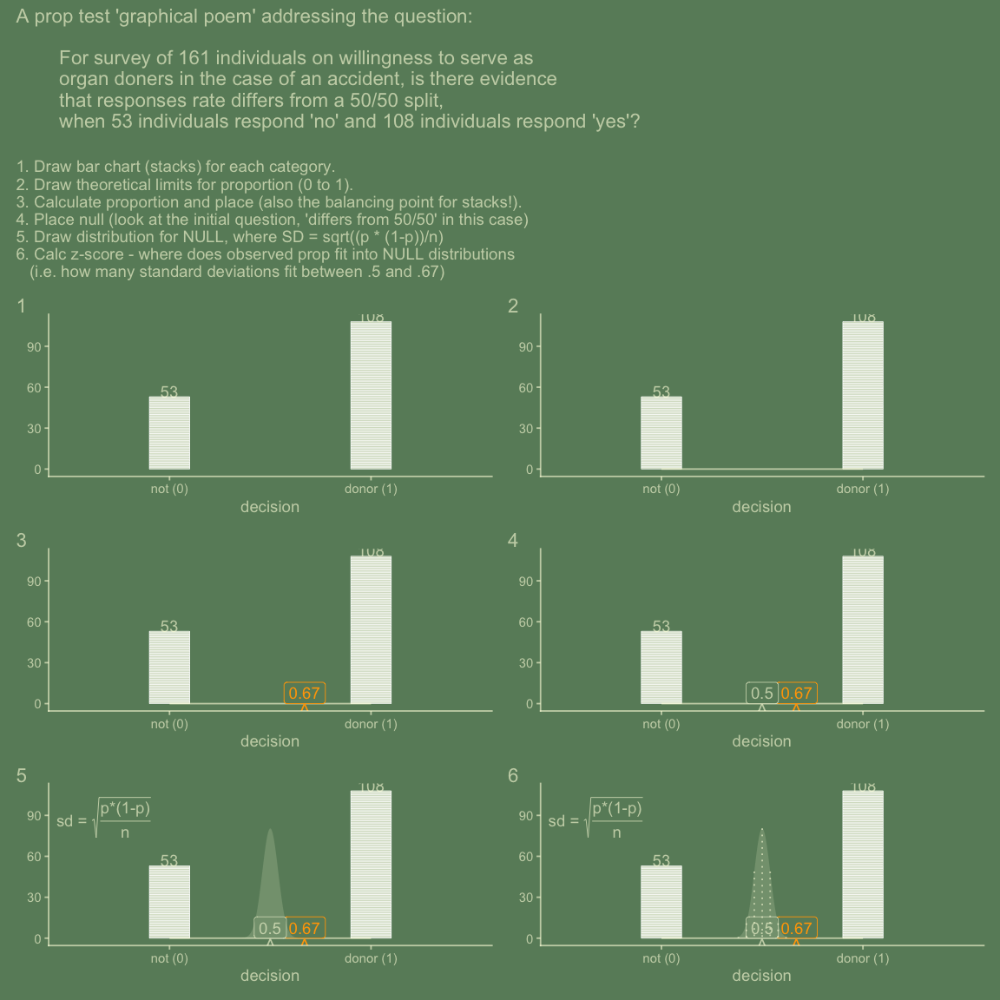<!-- -->

## {ggprop.test} is teaching ‘mvp’ (minimum viable package) that translates the visual logic of the prop test to ggplot2.

### Motivation for ggproptest and friends.

‘Telling a story with data’ is a popular idea. Let’s hear from some
folks on data storytelling:

> The book is meant as a guide to making visualizations that accurately
> reflect the data, *tell a story*, and look professional. - Clause
> Wilke in [Fundamentals of Data
> Visualization](https://clauswilke.com/dataviz/), I’m focusing on
> visual design and *storytelling* within our organization. – Will
> Chase’s introduction for [‘The *Glamour* of Graphics’ talk
> 2020](https://www.youtube.com/watch?v=h5cTacaWE6I)

> Companies like [Story Telling with
> Data](https://www.storytellingwithdata.com/) and [Building Stories
> with Data](https://www.cararthompson.com/) put this idea front and
> center to their missions.

However, the ‘data storytelling’ tends to be focused on reaching broad
audiences, communicating statistical summaries (rather than
trains-of-thought), and compelling complete plots. 📊

{ggprop.test} and friends, in contrast, are an attempt to capture the
*statistical stories* that are told in words and with visual schema all
the time in classrooms, but don’t yet have translations to code.

{ggprop.test} exists to allow instructors and students to engage with
the logic of statistical tests and techniques, often presented
step-by-step on a chalkboard 🧑‍🏫 in a class room, but now also
programmatically!

Which we don’t aim to replace the chalkboard/paper 📝 experience but
compliment it —- it’s the inspiration for this project. See [New
approaches to light-weight ‘geom’ (layer) extension]()
<https://evamaerey.github.io/mytidytuesday/2024-10-29-asa-cowy-fall-2024/asa-cowy-fall-2024.html#22>)

Having tools like ggprop.test might mean that instead of using the logic
a handful of times for a handful of examples, student and instructors
might walk through this logic *large number* of times - becoming **not
just familiar** with the logic, but **fluent** with the visual,
statistical story.

Under the hood, ggplot2 extension is used so that individual concepts
can be delivered in both a semantic and visual way.

### An introductiong to packaging requirements via ggprop.test

{ggprop.test} is an ‘mvp’ (a minimal viable product/package). This type
of package identifies the minimum required to deliver functionality, but
stops short of putting in additional work that might be required to get
a package to CRAN and doesn’t adhere to all of [packaging best
practices](https://r-pkgs.org/), noting that student feedback and might
lead to pretty dramatic changes and rewrites.

In our Spring 2026 class, we’ll pull back the curtain on package a tad,
by having Let’s have a look at the ‘mvp’ ggprop.test structure (which
does have a lot in common with full-blown CRAN-ready packages):
<https://github.com/EvaMaeRey/ggprop.test>

<details>

``` r
fs::dir_tree()
#> .
#> ├── DESCRIPTION
#> ├── NAMESPACE
#> ├── R
#> │   ├── collections_null.R
#> │   ├── compute_prop_viz.R
#> │   ├── gen_under_null.R
#> │   ├── raw_data_viz.R
#> │   └── statexpress.R
#> ├── README.Rmd
#> ├── README.md
#> ├── README_files
#> │   └── figure-gfm
#> │       ├── prop_poem-1.png
#> │       ├── test_interlude-1.png
#> │       ├── test_interlude-2.png
#> │       ├── test_interlude-3.png
#> │       ├── unnamed-chunk-10-1.png
#> │       ├── unnamed-chunk-10-2.png
#> │       ├── unnamed-chunk-10-3.png
#> │       ├── unnamed-chunk-10-4.png
#> │       ├── unnamed-chunk-10-5.png
#> │       ├── unnamed-chunk-10-6.png
#> │       ├── unnamed-chunk-10-7.png
#> │       ├── unnamed-chunk-10-8.png
#> │       ├── unnamed-chunk-11-1.png
#> │       ├── unnamed-chunk-11-2.png
#> │       ├── unnamed-chunk-11-3.png
#> │       ├── unnamed-chunk-11-4.png
#> │       ├── unnamed-chunk-11-5.png
#> │       ├── unnamed-chunk-11-6.png
#> │       ├── unnamed-chunk-11-7.png
#> │       ├── unnamed-chunk-11-8.png
#> │       ├── unnamed-chunk-12-1.png
#> │       ├── unnamed-chunk-12-2.png
#> │       ├── unnamed-chunk-13-1.png
#> │       ├── unnamed-chunk-13-2.png
#> │       ├── unnamed-chunk-14-1.png
#> │       ├── unnamed-chunk-14-2.png
#> │       ├── unnamed-chunk-14-3.png
#> │       ├── unnamed-chunk-14-4.png
#> │       ├── unnamed-chunk-14-5.png
#> │       ├── unnamed-chunk-14-6.png
#> │       ├── unnamed-chunk-14-7.png
#> │       ├── unnamed-chunk-14-8.png
#> │       ├── unnamed-chunk-15-1.png
#> │       ├── unnamed-chunk-15-2.png
#> │       ├── unnamed-chunk-15-3.png
#> │       ├── unnamed-chunk-16-1.png
#> │       ├── unnamed-chunk-16-2.png
#> │       ├── unnamed-chunk-16-3.png
#> │       ├── unnamed-chunk-17-1.png
#> │       ├── unnamed-chunk-17-2.png
#> │       ├── unnamed-chunk-17-3.png
#> │       ├── unnamed-chunk-18-1.png
#> │       ├── unnamed-chunk-18-2.png
#> │       ├── unnamed-chunk-18-3.png
#> │       ├── unnamed-chunk-19-1.png
#> │       ├── unnamed-chunk-19-2.png
#> │       ├── unnamed-chunk-20-1.png
#> │       ├── unnamed-chunk-20-2.png
#> │       ├── unnamed-chunk-3-1.png
#> │       ├── unnamed-chunk-4-1.png
#> │       ├── unnamed-chunk-4-2.png
#> │       ├── unnamed-chunk-4-3.png
#> │       ├── unnamed-chunk-4-4.png
#> │       ├── unnamed-chunk-5-1.png
#> │       ├── unnamed-chunk-5-2.png
#> │       ├── unnamed-chunk-5-3.png
#> │       ├── unnamed-chunk-6-1.png
#> │       ├── unnamed-chunk-6-2.png
#> │       ├── unnamed-chunk-7-1.png
#> │       ├── unnamed-chunk-7-2.png
#> │       ├── unnamed-chunk-8-1.png
#> │       ├── unnamed-chunk-8-2.png
#> │       ├── unnamed-chunk-8-3.png
#> │       ├── unnamed-chunk-8-4.png
#> │       ├── unnamed-chunk-8-5.png
#> │       ├── unnamed-chunk-8-6.png
#> │       ├── unnamed-chunk-8-7.png
#> │       ├── unnamed-chunk-8-8.png
#> │       ├── unnamed-chunk-9-1.png
#> │       ├── unnamed-chunk-9-2.png
#> │       ├── unnamed-chunk-9-3.png
#> │       ├── unnamed-chunk-9-4.png
#> │       ├── unnamed-chunk-9-5.png
#> │       ├── unnamed-chunk-9-6.png
#> │       ├── unnamed-chunk-9-7.png
#> │       └── unnamed-chunk-9-8.png
#> ├── data
#> │   ├── dolphin_data.rda
#> │   ├── donor_data.rda
#> │   └── scissors_data.rda
#> ├── ggprop.test.Rproj
#> └── man
```

Goal for package functions?

- ‘Erogenomics’.  
- Trace a train of thought…
- Approximate the wonderful analogue experience

``` r
knitr::include_graphics("https://miro.medium.com/v2/resize:fit:1400/format:webp/1*hZubBVjVDcl8ZixE-WRDvA.jpeg")
```

<!-- -->

``` r

knitr::include_graphics("https://images.unsplash.com/photo-1535535112387-56ffe8db21ff?q=80&w=2074&auto=format&fit=crop&ixlib=rb-4.1.0&ixid=M3wxMjA3fDB8MHxwaG90by1wYWdlfHx8fGVufDB8fHx8fA%3D%3D")
```

<!-- -->

``` r

knitr::include_graphics("https://media.licdn.com/dms/image/v2/D5622AQEoFtfFtQr-GQ/feedshare-shrink_800/B56ZVsPIDMGQAg-/0/1741277660204?e=1778716800&v=beta&t=K-bChkmu9opCHJS4QZkkF9q3gs23gG8D6w4bKGCcpz8")
```

<!-- -->

</details>

------------------------------------------------------------------------

# Back to exploring the prop test!! Yay!!

{ggprop.test} can be installed as follows…

``` r
library(remotes)
install_github("EvaMaeRey/ggprop.test")
```

``` r
library(tidyverse)
library(ggprop.test)
```

# Data and Scenarios

### scenario 1: organ donation

> Motivating question: For survey of 161 individuals on willingness to
> serve as organ doners in the case of an accident, is there evidence
> that responses rate differs from a 50/50 split, when 53 individuals
> respond ‘no’ and 108 individuals respond ‘yes’?

> Does the sample provide statistical evidence that there isn’t a 50-50
> split in preference for donation? Or indiffernece (like people are
> just answering randomly because they are not paying attention). Is
> their answer equivelant to tossing a coin?

<details>

“<https://www.isi-stats.com/isi/data/prelim/OrganDonor.txt>”

``` r
library(tidyverse)

set.seed(1234)
donor_data <- rep(c("donor (1)", "not (0)"), c(108,53)) |> 
  fct_rev() |> 
  tibble(decision = _) |> 
  sample_frac()

head(donor_data)
#> # A tibble: 6 × 1
#>   decision 
#>   <fct>    
#> 1 donor (1)
#> 2 donor (1)
#> 3 not (0)  
#> 4 donor (1)
#> 5 not (0)  
#> 6 not (0)

usethis::use_data(donor_data, overwrite = T)

donor_data |> 
  count(decision) |> 
  mutate(prop = n/sum(n))
#> # A tibble: 2 × 3
#>   decision      n  prop
#>   <fct>     <int> <dbl>
#> 1 not (0)      53 0.329
#> 2 donor (1)   108 0.671
```

</details>

How can ggprop.test functions help visualize the basics of this
question?

What is the proportion opting in?

``` r
donor_data |> 
  pull(decision) |> 
  table()
#> 
#>   not (0) donor (1) 
#>        53       108
```

### scenario 2: dolphins

<details>

``` r
set.seed(12345)
dolphin_data <- rep(c("Correct (1)", 
                      "Not Correct (0)"), 
                    c(15, 1)) |> 
  sample() |>
  tibble(observed = _) |>
  dplyr::mutate(observed = fct_rev(observed))

usethis::use_data(dolphin_data, overwrite = T)
```

</details>

``` r
dolphin_data
#> # A tibble: 16 × 1
#>    observed       
#>    <fct>          
#>  1 Correct (1)    
#>  2 Correct (1)    
#>  3 Correct (1)    
#>  4 Correct (1)    
#>  5 Correct (1)    
#>  6 Not Correct (0)
#>  7 Correct (1)    
#>  8 Correct (1)    
#>  9 Correct (1)    
#> 10 Correct (1)    
#> 11 Correct (1)    
#> 12 Correct (1)    
#> 13 Correct (1)    
#> 14 Correct (1)    
#> 15 Correct (1)    
#> 16 Correct (1)
```

> See too. ‘Fishermen talking to dolphins’
> <https://www.youtube.com/watch?v=6MZqKfUMFn0>

> Is the US a member of the ‘Agreement on the International Dolphin
> Conservation Program?’ Agreement on the International Dolphin
> Conservation Program -
> <https://www.state.gov/international-dolphin-conservation-program>

### scenario 3: Rock paper scissors

<details>

``` r
set.seed(12345)
scissors_data <- rep(c("not scissors (0)", "scissors (1)"), 
                     c(16, 4)) |> 
  sample() |>
  tibble(thrown = _) |>
  dplyr::mutate(thrown = factor(thrown))


usethis::use_data(scissors_data, overwrite = T)
```

</details>

``` r
scissors_data
#> # A tibble: 20 × 1
#>    thrown          
#>    <fct>           
#>  1 not scissors (0)
#>  2 scissors (1)    
#>  3 not scissors (0)
#>  4 not scissors (0)
#>  5 scissors (1)    
#>  6 not scissors (0)
#>  7 not scissors (0)
#>  8 not scissors (0)
#>  9 scissors (1)    
#> 10 not scissors (0)
#> 11 not scissors (0)
#> 12 not scissors (0)
#> 13 not scissors (0)
#> 14 not scissors (0)
#> 15 not scissors (0)
#> 16 not scissors (0)
#> 17 not scissors (0)
#> 18 scissors (1)    
#> 19 not scissors (0)
#> 20 not scissors (0)
```

------------------------------------------------------------------------

### On demand scenarios

``` r
create_prop_data <- function(failure = "failure (0)", 
                             success = "success (1)", 
                             num_failure = 5, 
                             num_success = 5, 
                             var_name = "outcome"){
  
   outcome <-  c(failure, success) |> rep(c(num_failure, num_success)) |> sample()

   tibble(outcome)
  
}
```

“Kissing right” example…
<https://www.isi-stats.com/isi/labs/lab3/lab3_1.html>

‘In the actual study, Dr. Güntürkün observed 80 of the 124 couples in
his sample turn to the right.’

``` r
create_prop_data() |> head()
#> # A tibble: 6 × 1
#>   outcome    
#>   <chr>      
#> 1 success (1)
#> 2 failure (0)
#> 3 failure (0)
#> 4 success (1)
#> 5 success (1)
#> 6 success (1)

create_prop_data(failure = "not kiss right (0)",
                 success = "kiss right (1)",
                 num_failure = 124-80,
                 num_success = 80)
#> # A tibble: 124 × 1
#>    outcome           
#>    <chr>             
#>  1 not kiss right (0)
#>  2 not kiss right (0)
#>  3 not kiss right (0)
#>  4 kiss right (1)    
#>  5 kiss right (1)    
#>  6 not kiss right (0)
#>  7 not kiss right (0)
#>  8 not kiss right (0)
#>  9 kiss right (1)    
#> 10 kiss right (1)    
#> # ℹ 114 more rows
```

------------------------------------------------------------------------

# Visualizing raw data

<details>

#### cloning statexpress functions

Some convenience functions from {statexpress} are used, because we want
this to be a bit more self-contained at this point, so we just clone
them for now. statexpress is evolving and is not on CRAN.

``` r
qlayer <- function (mapping = NULL, data = NULL, geom = ggplot2::GeomPoint, stat = StatIdentity, 
    position = position_identity(), ..., na.rm = FALSE, show.legend = NA, 
    inherit.aes = TRUE) 
{
    ggplot2::layer(data = data, mapping = mapping, geom = geom, 
        stat = stat, position = position, show.legend = show.legend, 
        inherit.aes = inherit.aes, params = rlang::list2(na.rm = na.rm, 
            ...))
}

qstat <- function (compute_group = ggplot2::Stat$compute_group, ...) 
{
    ggplot2::ggproto(NULL, Stat, compute_group = compute_group, 
        ...)
}

qstat_panel <- function (compute_panel, ...) 
{
    ggplot2::ggproto(NULL, Stat, compute_panel = compute_panel, 
        ...)
}


proto_update <- function (`_class`, `_inherit`, default_aes_update = NULL, ...) 
{
    if (!is.null(default_aes_update)) {
        default_aes <- aes(!!!modifyList(`_inherit`$default_aes, 
            default_aes_update))
    }
    ggplot2::ggproto(`_class` = `_class`, `_inherit` = `_inherit`, 
        default_aes = default_aes, ...)
}

qproto_update <- function (`_inherit`, default_aes_update = NULL, ...) 
{
    proto_update(NULL, `_inherit`, default_aes_update = default_aes_update, 
        ...)
}
```

#### And then define the functions…

``` r
# 1. layer stack of bricks
compute_group_bricks <- function(data, scales, width = .2){
  
  data |> 
    dplyr::mutate(row = row_number()) |> 
    dplyr::mutate(y = row - .5) |> 
    dplyr::mutate(width = width)
  
}


# 2. layer label stack with count
compute_group_count <- function(data, scales){
  
  data |> 
    dplyr::count(x) |> 
    dplyr::mutate(y = n,
           label = n)
  
}


# 3. layer add x span
compute_balance <- function(data, scales){
  
  data |> 
    dplyr::summarise(min_x = min(x),
              xend = max(x),
              y = 0,
              yend = 0) |> 
    dplyr::rename(x = min_x)
  
}


#' @export
geom_stack <- function(...){
  qlayer(geom = qproto_update(ggplot2::GeomTile, ggplot2::aes(color = "white")), 
         stat = qstat(compute_group_bricks), 
         ...)
  } 

#' @export
geom_stack_label <- function(...){
  qlayer(geom = qproto_update(ggplot2::GeomText, ggplot2::aes(vjust = 0)), 
         stat = qstat(compute_group_count), 
         ...)
  } 

#' @export
geom_support <- function(...){
  qlayer(geom = ggplot2::GeomSegment, 
         stat = qstat_panel(compute_balance), 
         ...)
  }
```

</details>

``` r
theme_minimal(paper = "grey25", 
              ink = "whitesmoke" |> alpha(.9),
              accent = "palevioletred2" |> alpha(.9)) |> 
  set_theme()

donor_data |> 
  ggplot() + 
  aes(x = decision) + 
  geom_stack() + 
  geom_stack_label() + 
  geom_support()
```

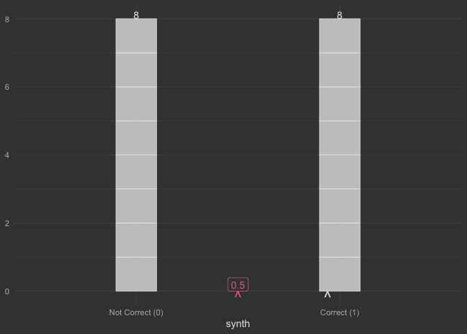<!-- -->

``` r

donor_base_plot <- last_plot()


dolphin_data |> 
  ggplot() + 
  aes(x = observed) + 
  geom_stack() + 
  geom_stack_label() + 
  geom_support()
```

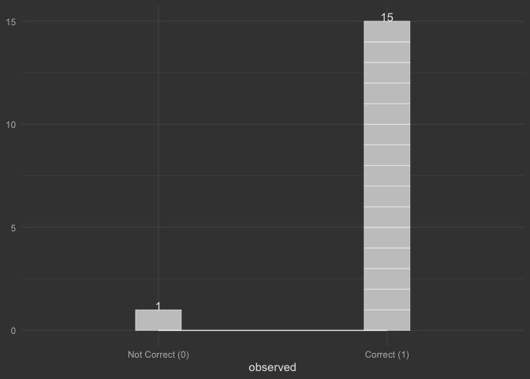<!-- -->

``` r

dolphins_base_plot <- last_plot()

scissors_data |>
  ggplot() + 
  aes(x = thrown) +
  geom_stack() + 
  geom_stack_label() + 
  geom_support()
```

<!-- -->

``` r

scissors_base_plot <- last_plot()
```

# Calc and Viz the Proportion, allowing null to be visualized

<details>

``` r
# 4. layer add balancing point 
compute_xmean_at_y0 <- function(data, scales){
  
  data |> 
    dplyr::summarise(x = mean(x),
              y = 0, 
              label = "^") 
  
}


# 5. layer add balancing point value label
compute_xmean_at_y0_label <- function(data, scales){
  
  data |> 
    dplyr::summarise(x = mean(x),
              y = 0, 
              label = after_stat(round(x, 2))) 
  
}


# 6. Add 'point' for asserted balancing point (null)
compute_panel_prop_asserted <- function(data, scales, value = .5){
  
  # stamp type layer - so ignore input data
  data.frame(y = 0, 
             x = value,
             label = "^"
             )
  
}

# 6. Add label for asserted balancing point (null)
compute_panel_prop_asserted_label <- function(data, scales, value = .5){
  
  # stamp type layer - so ignor input data
  data.frame(y = 0, 
             x = value,
             label = round(value, 2)
             )
  
}


scale_x_prop <- function(...){

  scale_x_discrete(palette = scales::pal_manual(0:1), ...)

}

#' @export
geom_prop <- function(...){
  list(
  qlayer(geom = qproto_update(ggplot2::GeomText, 
                              ggplot2::aes(size = 6, vjust = 1,
                                           color = ggplot2::from_theme(colour %||% accent))),
         stat = qstat_panel(compute_xmean_at_y0),
         ...),
  scale_x_prop()
  )
  }

#' @export
geom_prop_label <- function(...){ 
  qlayer(geom = qproto_update(ggplot2::GeomLabel, 
                              ggplot2::aes(fill = ggplot2::from_theme(colour %||% paper), 
                                           color = ggplot2::from_theme(colour %||% accent),
                                           label.size = NA, vjust = 0)),
         stat = qstat_panel(compute_xmean_at_y0_label), 
         ...) 
  }

#' @export
stamp_prop <- function(value = .5, ...){ 
  
  # qlayer(geom = qproto_update(ggplot2::GeomText, 
  #                             ggplot2::aes(size = 6, 
  #                                          vjust = 1, 
  #                                          color = ggplot2::from_theme(colour %||% ink))),
  #        stat = qstat_panel(compute_panel_prop_asserted), 
  #        data = data.frame(x = 1), 
  #        inherit.aes = FALSE,
  #        ...
  #        )
  
  annotate(geom = qproto_update(ggplot2::GeomText, 
                              ggplot2::aes(size = 6, 
                                           vjust = 1, 
                                           color = ggplot2::from_theme(colour %||% ink))),
           x = value, y = 0, label = "^")
  
  
  }
  
#' @export  
stamp_prop_label <- function(value = .5, ...){  
  # qlayer(geom = qproto_update(ggplot2::GeomLabel, 
  #                             ggplot2::aes(fill = ggplot2::from_theme(colour %||% paper), 
  #                                 label.size = NA, vjust = 0, 
  #                                 color = ggplot2::from_theme(colour %||% ink))),
  #        stat = qstat_panel(compute_panel_prop_asserted_label), 
  #        data = data.frame(x = 1), 
  #        inherit.aes = FALSE,
  #        ...
  #        )
  
  GeomLabelExtra <- qproto_update(ggplot2::GeomLabel, 
                               ggplot2::aes(fill = ggplot2::from_theme(colour %||% paper), 
                                   label.size = NA, vjust = 0, 
                                   color = ggplot2::from_theme(colour %||% ink)))
  
  annotate(geom = GeomLabelExtra,
           x = value, 
           y = 0, 
           label = value)
  
  }
```

</details>

``` r
donor_base_plot + 
  geom_prop() + 
  geom_prop_label() + 
  stamp_prop() + 
  stamp_prop_label()
```

<!-- -->

``` r

donors_balance_plot <- last_plot()

dolphins_base_plot + 
  geom_prop() + 
  geom_prop_label() + 
  stamp_prop() + 
  stamp_prop_label()
```

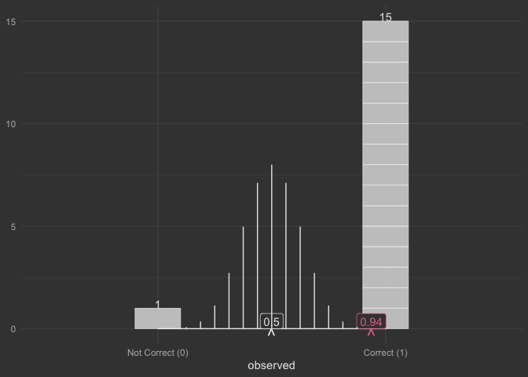<!-- -->

``` r

dolphins_balance_plot <- last_plot()

scissors_base_plot + 
  geom_prop() + 
  geom_prop_label() + 
  stamp_prop(.33) + 
  stamp_prop_label(.33)
```

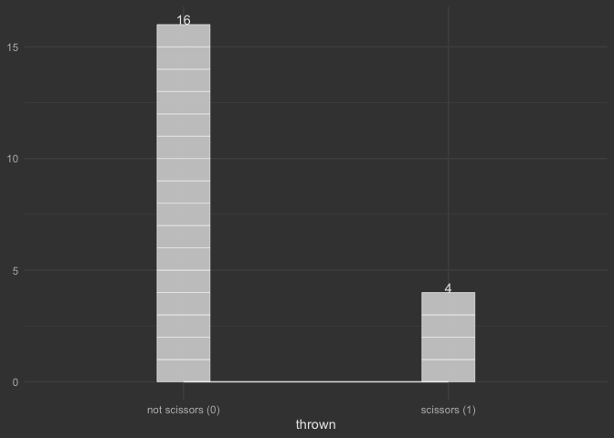<!-- -->

# Interlude: What individual outcomes *would* we observe under null hypothesis?

<details>

``` r
#' @export 
to_synthetic <- function(x, prob = .5){
  
  levels(x) |>  # take two 
    sample(size = length(x), 
           replace = T, 
           prob = c(1-prob, prob)) |> 
    # restore category ordering
    factor(levels = levels(x))
  
}


#' @export
data_add_synth <- function(data, var, prob = .5){
  
  x <- data |> 
    pull({{var}})
  
  generated <- to_synthetic(x, prob = prob)
  
  data |> 
    mutate(synthetic = generated)
  
}


# 
# #' @export
# x_from_null <- function(data = NULL, prob = .5) {
# 
#   structure(
#     list(prob = prob), 
#     class = "x_from_null"
#     )
# 
# }
# 
# 
# #' @import ggplot2
# #' @importFrom ggplot2 ggplot_add
# #' @export
# ggplot_add.x_from_null <- function(object, plot, object_name) {
#   
#   xname <- plot@mapping |> as.character() |> str_remove("~")
#   
#   xname
#   
#   var <- plot$data |> pull(xname)
#   
#   plot$data[xname] <-  
#      sample(levels(var), 
#             size = length(var), 
#             replace = T, prob = c(1-object$prob, object$prob)
#             ) |> 
#      # restore category ordering
#     factor(levels = levels(var))
#   
#   plot + labs(x = "plausible from null") + 
#   stamp_prop(value = mean(var |> as.numeric()) -1 ) + 
#   stamp_prop_label(value = mean(var |> as.numeric()) - 1) 
# 
# }
```

</details>

How many trials where we are drawing from null, before we see something
as far from .5 as .67?

``` r
dolphin_data |> 
  data_add_synth(var = observed, prob = .5) 
#> # A tibble: 16 × 2
#>    observed        synthetic      
#>    <fct>           <fct>          
#>  1 Correct (1)     Correct (1)    
#>  2 Correct (1)     Correct (1)    
#>  3 Correct (1)     Not Correct (0)
#>  4 Correct (1)     Not Correct (0)
#>  5 Correct (1)     Correct (1)    
#>  6 Not Correct (0) Correct (1)    
#>  7 Correct (1)     Correct (1)    
#>  8 Correct (1)     Correct (1)    
#>  9 Correct (1)     Not Correct (0)
#> 10 Correct (1)     Not Correct (0)
#> 11 Correct (1)     Not Correct (0)
#> 12 Correct (1)     Not Correct (0)
#> 13 Correct (1)     Correct (1)    
#> 14 Correct (1)     Correct (1)    
#> 15 Correct (1)     Not Correct (0)
#> 16 Correct (1)     Correct (1)

dolphin_data |> 
  mutate(synth = to_synthetic(observed)) |>
  ggplot() + 
  aes(x = synth) + 
  geom_stack() + 
  geom_stack_label() +
  geom_prop() + 
  geom_prop_label() + 
  stamp_prop(.94) + # observed now for reference
  stamp_prop_label(.94)
```

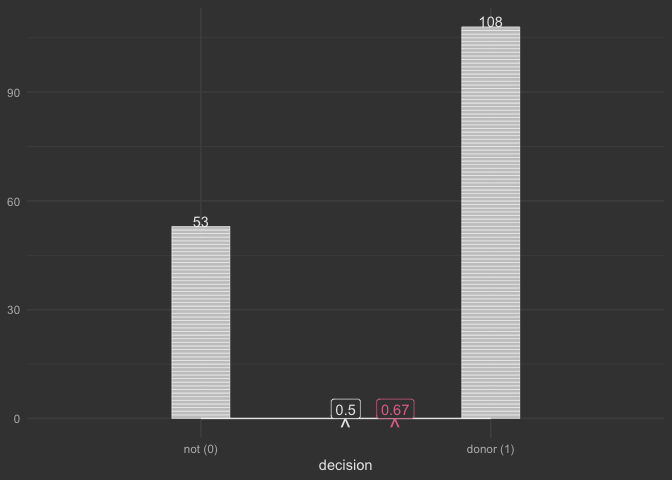<!-- -->

``` r
  
  
donor_data |> 
  mutate(synth = to_synthetic(decision)) |>
  ggplot() + 
  aes(x = synth) + 
  geom_stack() + 
  geom_stack_label() +
  geom_prop() + 
  geom_prop_label() + 
  stamp_prop(.67) + # observed now for reference
  stamp_prop_label(.67)  
```

<!-- -->

``` r


scissors_data |> 
  mutate(synth = to_synthetic(thrown)) |>
  ggplot() + 
  aes(x = synth) + 
  geom_stack() + 
  geom_stack_label() +
  geom_prop() + 
  geom_prop_label() + 
  stamp_prop(.25) + # observed now for reference
  stamp_prop_label(.25)  
```

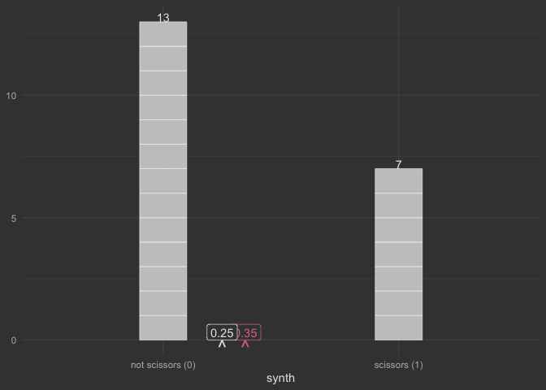<!-- -->

------------------------------------------------------------------------

Would we reflect: “I don’t think that the null is true. It’d be
extremely rare to see something as big as .67 if the null were true. The
observed balance (proportion) of .67 doesn’t look consistent with a
population balance of .5”

–

Term of art: “we reject the null hypothesis”

# Distributions for the Null: What collections of hypothetical outcomes *could* we observe under null hypothesis?

<details>

``` r
# 7. normal distribution based on null and n
compute_dnorm_prop <- function(data, scales, null = .5, dist_sds = seq(-3.5, 3.5, by = .1)
){
  
  n <- data |> nrow()
  n_max <- data |> dplyr::count(.by = x) |> dplyr::pull() |> max()

  
  sd = sqrt(null * (1 - null)/n) # sd of the null distribution
  
  q <- dist_sds * sd + null
  
  data.frame(x = q) |>
    dplyr::mutate(height = dnorm(q, sd = sd, mean = null)) |>
    dplyr::mutate(height_max = dnorm(0, sd = sd, mean = 0)) |>
    dplyr::mutate(y = .5*n*height/height_max) |>  # This is a bit fragile...
    dplyr::mutate(xend = x,
           yend = 0) |> 
    # @teunbrand ggplot2::GeomArea$setup_data() requires a group column. Your panel computation does not preserve groups, but it should.
    dplyr::mutate(group = 1) 
  
}  


# 8. normal distribution mean and sds based on null and n
compute_dnorm_prop_sds <- function(data, scales, null = .5,
  dist_sds = -4:4){
  
  n <- data |> nrow()
  
  n_max <- data |> dplyr::count(.by = x) |> dplyr::pull() |> max()
  
  sd = sqrt(null * (1 - null)/n) # sd of the null distribution
  
  q <- dist_sds * sd + null
  
  data.frame(x = q) |>
    dplyr::mutate(height = dnorm(q, sd = sd, mean = null)) |>
    dplyr::mutate(height_max = dnorm(0, sd = sd, mean = 0)) |>
    dplyr::mutate(y = .5*n*height/height_max) |> # This is a bit fragile...
    dplyr::mutate(xend = x,
           yend = 0)

}  


# Compute from ma206 data
#' @export
tidy_dbinom <- function(single_trial_prob = .5, num_trials = 10){

  num_successes <- 0:num_trials
  probability <- stats::dbinom(x = num_successes, size = num_trials, prob = single_trial_prob)

  tibble::tibble(num_successes, probability, single_trial_prob, num_trials)

}


compute_dbinom <- function(data, scales, prob = .5){
  
  num_trials <- nrow(data)
  
  tidy_dbinom(single_trial_prob = .5, 
              num_trials = num_trials) |> 
    mutate(x = num_successes/num_trials,
           y = num_trials/2*probability/max(probability),
           yend = 0,
           xend = x) 
  
}

#' @export
geom_binomial_null <- function(...){
  
  qlayer(geom = GeomSegment,
         stat = qstat_panel(compute_dbinom))
  
  
}

#' @export
geom_normal_prop_null <- function(...){
  qlayer(geom = qproto_update(ggplot2::GeomArea, ggplot2::aes(alpha = .2)),
         stat = qstat_panel(compute_dnorm_prop), 
         ...)
  } 

#' @export
geom_normal_prop_null_sds <- function(...){
   qlayer(geom = qproto_update(ggplot2::GeomSegment, ggplot2::aes(linetype = "dotted")),
          stat = qstat_panel(compute_dnorm_prop_sds), 
          ...)
  }

GeomTextBig <- ggproto("GeomTextBig", GeomText,
                       default_aes = 
                         modifyList(GeomText$default_aes,
                                    aes(size = from_theme(fontsize))))


#' @export
stamp_eq_norm_prop <- function(x = I(.125),
    y = I(.8), ...){
  
  annotate(
    "text",
    x = x,
    y = y,
    label = latex2exp::TeX("sd = \\sqrt{\\frac{p*(1-p)}{n}}", output = "character"),
    parse = TRUE, ...
  )

}
```

</details>

``` r
# dolphins with binomial only...
dolphins_balance_plot +
  geom_binomial_null()
```

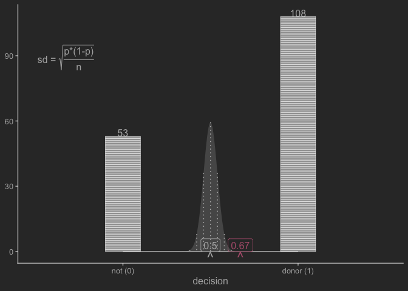<!-- -->

``` r

tidy_dbinom(num_trials = 16) |>
  mutate(prop = num_successes/16)
#> # A tibble: 17 × 5
#>    num_successes probability single_trial_prob num_trials   prop
#>            <int>       <dbl>             <dbl>      <dbl>  <dbl>
#>  1             0   0.0000153               0.5         16 0     
#>  2             1   0.000244                0.5         16 0.0625
#>  3             2   0.00183                 0.5         16 0.125 
#>  4             3   0.00854                 0.5         16 0.188 
#>  5             4   0.0278                  0.5         16 0.25  
#>  6             5   0.0667                  0.5         16 0.312 
#>  7             6   0.122                   0.5         16 0.375 
#>  8             7   0.175                   0.5         16 0.438 
#>  9             8   0.196                   0.5         16 0.5   
#> 10             9   0.175                   0.5         16 0.562 
#> 11            10   0.122                   0.5         16 0.625 
#> 12            11   0.0667                  0.5         16 0.688 
#> 13            12   0.0278                  0.5         16 0.75  
#> 14            13   0.00854                 0.5         16 0.812 
#> 15            14   0.00183                 0.5         16 0.875 
#> 16            15   0.000244                0.5         16 0.938 
#> 17            16   0.0000153               0.5         16 1
```

``` r
# donors w/ null distribution...
donors_balance_plot +
  geom_binomial_null()
```

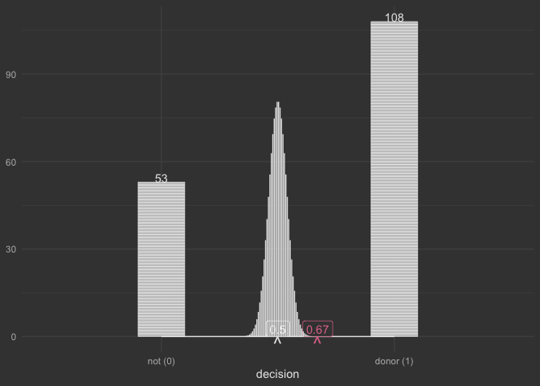<!-- -->

``` r


# donnors with null normal approximation...
donors_balance_plot +
  geom_normal_prop_null() + 
  geom_normal_prop_null_sds() +
  stamp_eq_norm_prop()
```

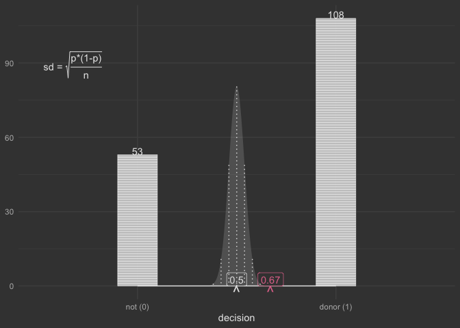<!-- -->

------------------------------------------------------------------------

# Minimal Packaging

``` r
# knitrExtra::chunk_names_get()

knitrExtra::chunk_to_dir("statexpress")
knitrExtra::chunk_to_dir("raw_data_viz")
knitrExtra::chunk_to_dir("compute_prop_viz")
knitrExtra::chunk_to_dir("gen_under_null")
knitrExtra::chunk_to_dir("collections_null")
```

``` r
usethis::use_package("dplyr")
usethis::use_package("ggplot2")

devtools::document()
devtools::check(".")
devtools::install(pkg = ".", upgrade = "never")
```

<!-- # epilogue... -->

<!-- Another approach that is less concerned with being a bridge to ggplot2 layer extension...?   -->

<!-- ```{r, eval = F, echo = F} -->

<!-- geom_support <- function(...){geom_segment(data = compute_balance, ...)} -->

<!-- geom_prop <- function(...){geom_point(data = compute_xmean_at_y0, label = "^", ...)} -->

<!-- donor |> -->

<!--   ggplot() +  -->

<!--   aes(x = decision) + -->

<!--   geom_support() + -->

<!--   geom_prop() -->

<!-- ``` -->
